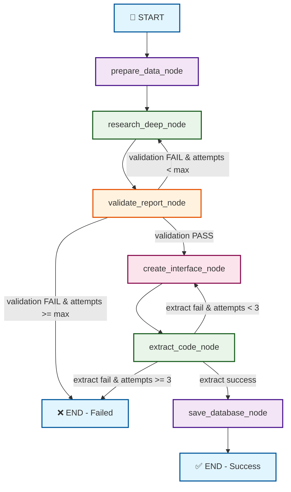

# 📊 Crypto Dashboard & AI Report Generator

Một ứng dụng web Flask toàn diện được thiết kế để cung cấp hai tính năng chính:
1. **Dashboard thị trường tiền mã hóa** theo thời gian thực với các chỉ số quan trọng
2. **Trình tạo báo cáo AI** - công cụ cho phép chuyển đổi tài liệu văn bản thành báo cáo web tương tác một cách tự động

**🔗 Xem trực tiếp tại:** [https://crypto-dashboard-app-thichuong.vercel.app/](https://crypto-dashboard-app-thichuong.vercel.app/)

## ✨ Tính Năng Nổi Bật

### 📈 Dashboard Thị T   │   ├── 📄 alternative_me.py # Fear & Greed Index
   │   ├── 📄 taapi.py        # Technical Analysis API (legacy)
   │   ├── 📄 report_generator.py # AI report creation (legacy)
   │   ├── 📄 report_workflow.py # LangGraph workflow (simplified)
   │   ├── 📄 progress_tracker.py # Progress tracking với SocketIO
   │   └── 📄 auto_report_scheduler.py # Scheduler với LangGraph integrationCrypto
* **Dữ liệu thời gian thực** với hệ thống caching thông minh (10 phút):
  * Giá **Bitcoin (BTC)** với biến động 24h và biểu đồ line chart
  * Tổng vốn hóa thị trường & khối lượng giao dịch toàn cầu
  * **Fear & Greed Index** (Chỉ số Sợ hãi & Tham lam) với gauge chart
  * **RSI indicator** (Relative Strength Index) cho BTC
* **Rate limiting thông minh** để tối ưu API calls và tránh vượt quota
* **API status monitoring** với endpoint `/api-status`

### 🤖 AI Report Generator
* **Chuyển đổi tài liệu thành web report** hoàn toàn tự động:
  * Hỗ trợ định dạng: `.docx` (Microsoft Word), `.odt` (OpenDocument), và `.pdf`
  * Tích hợp **Google Gemini 2.5 Pro** để phân tích và tạo nội dung
  * Sinh tự động HTML, CSS, và JavaScript với biểu đồ tương tác
* **Smart chart generation**: AI tự động chọn loại biểu đồ phù hợp (line, bar, doughnut, gauge)
* **Persistent storage**: Lưu trữ báo cáo vào database để xem lại sau này
* **🆕 Auto Report Generator với LangGraph**: Tạo báo cáo nghiên cứu thị trường crypto tự động
  * **🌐 LangGraph Workflow**: Workflow engine hiện đại cho complex AI pipelines
  * **📊 Modular Architecture**: Các nodes độc lập dễ test và maintain
  * **🔄 Smart Routing**: Conditional flows với retry logic (real-time only)
  * **📈 State Management**: Tracking toàn bộ quá trình từ input đến output
  * **🎯 Simplified UI**: Clean, minimalist interface chỉ với button loading states
  * **✅ Enhanced Validation**: Flexible validation cho phép báo cáo thiếu một số dữ liệu
  * Scheduler tự động chạy mỗi 3 giờ (có thể tùy chỉnh)
  * Báo cáo nghiên cứu sâu về thị trường tiền điện tử với Google Search integration
  * Phân tích tâm lý thị trường, kỹ thuật, và các yếu tố vĩ mô
  * Tạo giao diện web tương tác tự động từ dữ liệu mới nhất
  * **🛡️ Advanced Error Handling**: Retry logic với exponential backoff
  * **🎯 Real-time Data Only**: Chỉ sử dụng thông tin mới nhất từ internet (removed RSI dependency)
  * **✅ Smart Validation System**: Kiểm tra chất lượng với fallback graceful
  * **🔍 Observability**: Detailed logging và monitoring cho từng step

### 🎨 Giao Diện & UX
* **Modern responsive design** với Tailwind CSS
* **Dark/Light theme** với smooth transitions
* **Interactive SVG charts** được tối ưu performance:
  * Hover effects mượt mà với scale và brightness animations
  * Touch-friendly cho mobile devices
  * Accessibility support (ARIA labels, keyboard navigation)
* **Progressive loading** với skeleton screens

---

## 🔄 Workflow: AI Report Generation

Tính năng cốt lõi cho phép người dùng tạo báo cáo web tương tác từ tài liệu văn bản trong vài phút.

### 📋 Quy Trình Chi Tiết

1. **📤 Upload & Input**
   * Truy cập trang `/upload`
   * Cung cấp **Gemini API Key** (từ Google AI Studio)
   * Upload tài liệu: `.docx` hoặc `.odt`

2. **⚙️ AI Processing Pipeline với LangGraph**
   ```
   Document → LangGraph Workflow → Interactive Report
   ```
   * **State-driven processing**: Mỗi step được quản lý bởi LangGraph StateGraph
   * **Workflow nodes**:
     - `prepare_data_node`: Document parsing và setup
     - `research_deep_node`: AI analysis với Google Search (real-time data only)
     - `validate_report_node`: Quality assurance checking (PASS/FAIL only - no UNKNOWN acceptance)
     - `create_interface_node`: HTML/CSS/JS generation
     - `extract_code_node`: Code parsing và optimization với improved regex patterns
     - `save_database_node`: Persistent storage
   * **Error handling**: Automatic retry với conditional routing (no fallback - real-time only)
   * **Progress tracking**: Simplified UI với button loading states và activity log
   * **Enhanced validation**: Flexible validation system cho phép báo cáo thiếu một số dữ liệu không quan trọng

3. **🎨 Code Generation**
   * **HTML**: Semantic structure với accessibility support
   * **CSS**: Responsive design + dark/light theme variables
   * **JavaScript**: Interactive charts với optimized rendering
   * **Chart selection**: AI tự chọn chart type phù hợp:
     * `LineChart` cho dữ liệu time-series
     * `BarChart` cho so sánh categorical
     * `DoughnutChart` cho phần trăm/tỷ lệ
     * `GaugeChart` cho KPI/metrics

4. **💾 Storage & Delivery**
   * Lưu vào database (PostgreSQL/SQLite)
   * Auto-redirect về homepage
   * Real-time display với lazy loading

### 🔧 Technical Features
* **Error handling**: Graceful fallbacks cho API failures
* **Security**: Input validation + file type verification
* **Performance**: Async processing + progress indicators
* **Scalability**: Modular architecture cho easy extensions
---

## 🗄️ Database Architecture

Hệ thống lưu trữ được thiết kế tối ưu cho performance và scalability.

### 📊 Report Model Schema
```python
class Report(db.Model):
    id = db.Column(db.Integer, primary_key=True)
    html_content = db.Column(db.Text, nullable=False)
    css_content = db.Column(db.Text, nullable=True) 
    js_content = db.Column(db.Text, nullable=True)
    created_at = db.Column(db.DateTime, default=datetime.utcnow)
```

### 🔄 Data Flow & Caching Strategy
* **Production**: PostgreSQL + Redis caching
* **Development**: SQLite + SimpleCache
* **Cache TTL**: 10 minutes cho market data
* **Dynamic rendering**: Template injection cho real-time display
* **Archive system**: Historical reports trong `/instance/archive/`

### 🔍 Query Optimization
* Indexed queries cho faster retrieval
* Pagination support cho large datasets
* Lazy loading cho improved UX

---

## 🛠️ Tech Stack & Architecture

### Backend Stack
* **Framework**: Flask (Python 3.8+)
* **ORM**: SQLAlchemy với migration support
* **Database**: 
  * Production: PostgreSQL (Vercel)
  * Development: SQLite
* **Caching**: Redis (Production) / SimpleCache (Dev)
* **AI Integration**: Google Gemini API (`google-generativeai`)
* **Workflow Engine**: LangGraph cho complex AI pipelines
* **Document Processing**: `python-docx`, `odfpy`

### Frontend Stack  
* **Core**: HTML5, CSS3, JavaScript ES6+
* **Framework**: Tailwind CSS untuk utility-first styling
* **Charts**: Custom SVG-based chart library
* **Features**: 
  * Progressive enhancement
  * Dark/Light theme với CSS custom properties
  * Mobile-first responsive design
  * Accessibility (WCAG 2.1 AA)

### API Integration
* **CoinGecko API**: Market data & Bitcoin prices
* **Alternative.me API**: Fear & Greed Index
* **TAAPI API**: Technical indicators (RSI)
* **Rate limiting**: Smart queuing để avoid API limits

### Deployment & DevOps
* **Platform**: Vercel (Serverless)
* **CI/CD**: Automatic deployment từ GitHub
* **Environment**: Separate configs cho dev/prod
* **Monitoring**: Built-in API status endpoints

---

## 🚀 Setup & Development

### Quick Start
```bash
# Clone repository
git clone https://github.com/thichuong/crypto-dashboard-app.git
cd crypto-dashboard-app

# Setup virtual environment
python -m venv venv
source venv/bin/activate  # Linux/macOS
# venv\Scripts\activate    # Windows

# Install dependencies
pip install -r requirements.txt

# Build chart modules
python build.py

# Run development server
flask run
```

### Environment Configuration
1. **Tạo file `.env`** từ template:
   ```bash
   cp .env.example .env
   ```

2. **Cấu hình API keys và Auto Report Scheduler** trong `.env`:
   ```env
   # API Keys (optional for dashboard, required for AI report generator)
   COINGECKO_API_KEY=your_coingecko_key
   TAAPI_SECRET=your_taapi_secret
   GEMINI_API_KEY=your_gemini_api_key  # Required for AI reports
   
   # Auto Report Scheduler Settings
   ENABLE_AUTO_REPORT_SCHEDULER=true   # Set to true to enable auto reports
   AUTO_REPORT_INTERVAL_HOURS=3        # Generate report every 3 hours
   MAX_REPORT_ATTEMPTS=3               # Max retry attempts for report generation
   
   # Database (auto-configured)
   DATABASE_URL=sqlite:///instance/local_dev.db
   ```

3. **Bật tính năng Auto Report Scheduler**:
   * Thiết lập `GEMINI_API_KEY` với API key từ [Google AI Studio](https://makersuite.google.com/app/apikey)
   * Đặt `ENABLE_AUTO_REPORT_SCHEDULER=true` để bật scheduler
   * Tùy chỉnh `AUTO_REPORT_INTERVAL_HOURS` cho khoảng thời gian mong muốn
   * Khởi động lại ứng dụng để áp dụng thay đổi

### Development Workflow
* **Hot reload**: Flask development server tự động restart
* **Database**: SQLite file tại `instance/local_dev.db`
* **Static assets**: Auto-compilation với `build.py`
* **Testing**: Sử dụng files trong `/tests/` directory

### Production Deployment (Vercel)
```bash
# Install Vercel CLI
npm i -g vercel

# Deploy
vercel --prod
```

**Environment Variables cần thiết trên Vercel:**
- `DATABASE_URL`: PostgreSQL connection string
- `REDIS_URL`: Redis instance URL  
- `GEMINI_API_KEY`: Google Gemini API key (for AI reports)
- `ENABLE_AUTO_REPORT_SCHEDULER`: Set to "true" for auto reports
- `AUTO_REPORT_INTERVAL_HOURS`: Interval in hours (default: 3)
- `MAX_REPORT_ATTEMPTS`: Max retry attempts (default: 3)
- API keys (optional, có fallback graceful)

---

## 📖 Cách Sử Dụng

### 📈 Dashboard Crypto
1. Truy cập trang chủ để xem dashboard thời gian thực
2. Xem các chỉ số quan trọng: BTC price, market cap, Fear & Greed Index, RSI
3. Dashboard tự động cập nhật mỗi 10 phút

### 🤖 AI Report Generator

#### Tạo báo cáo từ file:
1. Truy cập `/upload` 
2. Chọn tab "Tải lên tệp"
3. Nhập Gemini API Key
4. Tải lên file (.docx, .odt, .pdf)
5. Nhấn "Xử lý và Tạo Báo cáo"

#### Scheduler tự động:
1. Cấu hình `GEMINI_API_KEY` và `ENABLE_AUTO_REPORT_SCHEDULER=true` trong `.env`
2. Khởi động lại ứng dụng
3. Hệ thống sẽ tự động tạo báo cáo mỗi 3 giờ (hoặc theo cấu hình)
4. Kiểm tra trạng thái scheduler tại `/scheduler-status`

- **Trang Auto Update System**:
  - **URL**: `/auto-update-system-<secret_key>` (yêu cầu secret key để truy cập)
  - **Bảo mật**: 
    - Cấu hình `AUTO_UPDATE_SECRET_KEY` trong `.env`
    - Chỉ những người có secret key mới truy cập được
    - Log tất cả các attempt truy cập
  - **Tính năng**:
    - Theo dõi trạng thái scheduler thời gian thực
    - **🎯 Simplified UI**: Clean interface với button loading states
    - **📋 Activity Log**: Real-time progress tracking qua activity log
    - Tạo báo cáo thủ công bằng một click
    - Xem nhật ký hoạt động chi tiết
    - Kiểm tra cấu hình hệ thống
    - **🛡️ Error Recovery**: Workflow state inspection và manual retry
    - **✅ Enhanced Validation**: Flexible validation system với graceful fallbacks

### 📊 Xem Báo Cáo
- Trang chủ hiển thị báo cáo mới nhất
- Truy cập `/reports` để xem tất cả báo cáo
- Mỗi báo cáo có URL riêng: `/report/<id>`

---

## 🌐 LangGraph Workflow Architecture

### 🔄 Auto Report Generation Pipeline

Hệ thống sử dụng LangGraph để quản lý complex AI workflow với state management và error handling tiên tiến.

#### � **LangGraph Workflow Diagram**



#### 📋 **Node Details & Functions**

```
┌─────────────────────────────────────────────────────────────────┐
│  🔧 prepare_data_node                                           │
├─────────────────────────────────────────────────────────────────┤
│  • Khởi tạo Gemini client với API key                         │
│  • Đọc và xử lý prompt templates                              │
│  • Setup file paths và environment                            │
│  • Thay thế date placeholders                                 │
└─────────────────────────────────────────────────────────────────┘
                               │
                               ▼
┌─────────────────────────────────────────────────────────────────┐
│  🌐 research_deep_node                                          │
├─────────────────────────────────────────────────────────────────┤
│  • Google Search integration với AI tools                     │
│  • Thu thập dữ liệu real-time từ internet                     │
│  • Phân tích thị trường crypto với thinking budget            │
│  • Retry logic với exponential backoff (30s→60s→90s)         │
│  • Max attempts: configurable (default: 3)                   │
└─────────────────────────────────────────────────────────────────┘
                               │
                               ▼
┌─────────────────────────────────────────────────────────────────┐
│  ✅ validate_report_node                                        │
├─────────────────────────────────────────────────────────────────┤
│  • Lấy dữ liệu real-time từ dashboard APIs                    │
│  • So sánh với research content từ AI                         │
│  • Pattern matching: KẾT QUẢ KIỂM TRA: PASS/FAIL            │
│  • Fallback validation nếu không có real-time data            │
│  • Flexible criteria: chấp nhận báo cáo thiếu data không QT   │
└─────────────────────────────────────────────────────────────────┘
                               │
                    ┌──────────┴──────────┐
                    ▼                     ▼
                  PASS                   FAIL
                    │                     │
                    ▼              (retry ≤ max_attempts)
┌─────────────────────────────────────────────────────────────────┐
│  🎨 create_interface_node                                       │
├─────────────────────────────────────────────────────────────────┤
│  • Tạo HTML structure với semantic markup                     │
│  • Generate CSS với responsive design + themes                │
│  • Create JavaScript với interactive charts                   │
│  • AI chọn chart types: Line/Bar/Doughnut/Gauge              │
│  • Retry với interface attempt counter (max: 3)              │
└─────────────────────────────────────────────────────────────────┘
                               │
                               ▼
┌─────────────────────────────────────────────────────────────────┐
│  🔍 extract_code_node                                           │
├─────────────────────────────────────────────────────────────────┤
│  • Regex parsing cho HTML/CSS/JS code blocks                  │
│  • Enhanced patterns: ```html, ```css, ```js/javascript      │
│  • Success validation với multiple criteria                   │
│  • Fallback detection cho HTML tags ngoài code blocks        │
│  • Return: {html, css, js, success} với status flag          │
└─────────────────────────────────────────────────────────────────┘
                               │
                    ┌──────────┴──────────┐
                    ▼                     ▼
                 SUCCESS                 FAIL
                    │                     │
                    ▼        (retry interface ≤ 3 attempts)
┌─────────────────────────────────────────────────────────────────┐
│  💾 save_database_node                                          │
├─────────────────────────────────────────────────────────────────┤
│  • Tạo Report model instance                                  │
│  • Save HTML, CSS, JS content vào database                   │
│  • Handle Flask application context                           │
│  • Update progress tracker với success status                │
│  • Return final report ID                                     │
└─────────────────────────────────────────────────────────────────┘
```

#### 🛤️ **Conditional Routing Logic**

```python
# Validation Decision Tree
def should_retry_or_continue(state: ReportState):
    if state["validation_result"] == "PASS":
        return "continue"  # → create_interface_node
    elif state["current_attempt"] >= state["max_attempts"]:
        return "end"       # → END (failed)
    else:
        return "retry"     # → research_deep_node

# Interface Retry Decision Tree  
def should_retry_interface_or_continue(state: ReportState):
    if state["success"]:   # extract_code success
        return "continue"  # → save_database_node
    elif state.get("interface_attempt", 0) >= 3:
        return "end"       # → END (failed)
    else:
        return "retry_interface"  # → create_interface_node
```

#### 📊 **Workflow Node Execution Flow**

```
Time: 0s     │ Step 1: prepare_data_node
────────────────────────────────────────────────────
             │ ✓ Setup Gemini client
             │ ✓ Load prompt templates  
             │ ✓ Initialize state variables
Time: 5s     │

Time: 5s     │ Step 2: research_deep_node (Attempt 1)
────────────────────────────────────────────────────
             │ 🌐 Google Search + AI analysis
             │ 📊 Generate market research report
             │ ⏱️  Average: 60-120s (depends on AI thinking)
Time: 90s    │

Time: 90s    │ Step 3: validate_report_node
────────────────────────────────────────────────────
             │ 📡 Fetch real-time dashboard data
             │ 🔍 Compare with AI research content
             │ ✅ Result: PASS → continue
Time: 105s   │      FAIL → retry research (if attempts < max)

Time: 105s   │ Step 4: create_interface_node (Attempt 1)
────────────────────────────────────────────────────
             │ 🎨 Generate HTML structure
             │ 🎨 Create responsive CSS
             │ 📊 Generate interactive JavaScript
Time: 140s   │ ⏱️  Average: 30-45s

Time: 140s   │ Step 5: extract_code_node
────────────────────────────────────────────────────
             │ 🔍 Parse HTML/CSS/JS from AI response
             │ ✅ Validate extraction success
             │ ✅ Success → continue
Time: 142s   │      Fail → retry interface (if attempts < 3)

Time: 142s   │ Step 6: save_database_node
────────────────────────────────────────────────────
             │ 💾 Create Report database record
             │ 💾 Save HTML, CSS, JS content
             │ 🎉 Return final report ID
Time: 145s   │ ✅ WORKFLOW COMPLETE
```

#### 🔄 **Retry & Error Handling Scenarios**

```
Scenario 1: Research Retry
┌─────────────────────────────────────────────────────┐
│ research_deep → validate → FAIL → research_deep     │
│ (attempt 1)     (FAIL)            (attempt 2)      │
└─────────────────────────────────────────────────────┘

Scenario 2: Interface Retry  
┌─────────────────────────────────────────────────────┐
│ create_interface → extract_code → FAIL              │
│ (attempt 1)        (success: false)                │
│                           ↓                        │
│ create_interface ← ─ ─ ─ ─ ┘                       │
│ (attempt 2)                                        │
└─────────────────────────────────────────────────────┘

Scenario 3: Max Attempts Reached
┌─────────────────────────────────────────────────────┐
│ research_deep → validate → FAIL → END              │
│ (attempt 3)     (FAIL)            (max reached)    │
└─────────────────────────────────────────────────────┘
```

#### � **Workflow State Schema**

```python
class ReportState(TypedDict):
    # Session tracking
    session_id: str
    
    # Input parameters
    api_key: str
    max_attempts: int
    
    # Processing state
    research_analysis_prompt: Optional[str]
    data_validation_prompt: Optional[str]
    create_report_prompt: Optional[str]
    research_content: Optional[str]
    validation_result: Optional[str]
    interface_content: Optional[str]
    
    # Output
    html_content: Optional[str]
    css_content: Optional[str]
    js_content: Optional[str]
    report_id: Optional[int]
    
    # Control flow
    current_attempt: int
    error_messages: List[str]
    success: bool
    
    # Gemini client
    client: Optional[object]
    model: str
```

### 🏗️ **Benefits của LangGraph Implementation**

#### ✅ **Improved Maintainability**
* **Modular design**: Mỗi node là function độc lập
* **Clear separation**: Logic rõ ràng giữa các processing steps  
* **Easy testing**: Unit test từng node riêng lẻ
* **Scalable**: Dễ thêm nodes mới hoặc modify existing logic

#### 🔍 **Enhanced Observability**
* **State tracking**: Monitor state changes qua workflow
* **Node-level logging**: Chi tiết execution của từng step
* **Error context**: Complete error tracing với workflow path
* **Performance metrics**: Timing và resource usage per node

#### 🛡️ **Robust Error Handling**
* **Graceful degradation**: Smart retry mechanisms
* **State preservation**: Không mất state khi retry
* **Conditional flows**: Smart routing dựa trên results
* **Recovery mechanisms**: Resume từ checkpoint khi possible

#### 🔄 **Flexible Control Flow**
* **Dynamic routing**: Conditional edges based on state
* **Parallel execution**: Potential cho async processing
* **Retry strategies**: Per-node retry với custom logic
* **Circuit breakers**: Prevent cascade failures

#### 🎯 **Real-time Data Guarantee**
* **Fresh information**: Mỗi báo cáo đều có dữ liệu mới nhất
* **Internet dependency**: Yêu cầu Google Search cho accuracy
* **Quality assurance**: Chỉ chấp nhận PASS validation
* **No stale data**: Không có báo cáo dựa trên kiến thức cũ

---

## 🛡️ Error Handling & Reliability

### Auto Report Scheduler Resilience với LangGraph
Hệ thống được thiết kế để hoạt động ổn định với thông tin real-time:

#### 🌐 **LangGraph Workflow Architecture**
* **State Management**: Persistent state tracking qua tất cả workflow steps
* **Modular Nodes**: Mỗi processing step là một node độc lập
* **Conditional Routing**: Smart decision making dựa trên results và errors
* **Observability**: Built-in logging và monitoring cho từng node

#### 🔄 **Retry Logic với Exponential Backoff**
* **Node-level retry**: Mỗi node có thể retry riêng lẻ
* **Thời gian chờ tăng dần**: 30s → 60s → 90s
* **State preservation**: Giữ nguyên state khi retry
* **Áp dụng cho**: Research, interface generation, và database operations
* **Enhanced code extraction**: Improved regex patterns để extract HTML/CSS/JS từ AI response

#### 🎯 **Real-time Data Focus**
* **Simplified data sources**: Chỉ sử dụng 3 API cơ bản (CoinGecko, Alternative.me)
* **No RSI dependency**: Loại bỏ TAAPI/RSI để tăng reliability
* **Google Search required**: Luôn yêu cầu internet access cho dữ liệu mới nhất
* **Quality assurance**: Chỉ chấp nhận báo cáo PASS validation
* **Fresh data guarantee**: Mỗi báo cáo đều có thông tin từ internet

#### ✅ **Enhanced Validation System**
* **Flexible validation**: Cho phép báo cáo thiếu một số dữ liệu không quan trọng
* **Smart criteria**: Chỉ kiểm tra dữ liệu thực sự được đề cập trong báo cáo
* **Graceful fallback**: Basic content validation khi không có real-time data
* **No penalization**: Không bị FAIL vì thiếu dữ liệu không cần thiết

#### 🎨 **Simplified UI Experience**
* **Minimalist design**: Loại bỏ complex progress overlay
* **Button-focused feedback**: Loading states và visual indicators trên nút chính
* **Activity log**: Real-time updates thông qua activity log thay vì bảng phức tạp
* **Clean workflow**: Giảm thiểu UI clutter và tập trung vào core functionality

⚙️ **Configuration Options**
```env
# Tùy chỉnh error handling behavior
MAX_REPORT_ATTEMPTS=3           # Số lần thử tối đa
THINKING_BUDGET=32768          # AI thinking budget (128-32768)
```

#### 📊 **Monitoring & Debugging**
* **Node-level logging**: Chi tiết execution cho từng workflow step
* **State inspection**: Real-time monitoring state changes
* **Performance tracking**: Timing và resource usage per node
* **Error tracing**: Complete error context với workflow path
* **Simplified UI**: Clean activity log interface thay vì complex progress tables

---

## 🧪 Testing & Development Tools

### Chart Testing Suite (`/tests/`)
Bộ công cụ testing toàn diện cho chart components:

#### 🎯 **chart_tester.html** - Universal Chart Tester
* **Full test suite** cho tất cả chart types
* **Features**:
  * Test 4 loại: Gauge, Doughnut, Line, Bar charts
  * Manual data input hoặc random generation
  * Dark/Light theme switcher
  * Responsive testing tools
  * Interactive hover debugging
  * Performance monitoring

#### 🍩 **test_doughnut_hover.html** - Specialized Hover Testing
* **Focus**: Doughnut chart hover interactions
* **Test scenarios**:
  * Basic segments (3-5 items)
  * Many segments (10+ items) 
  * Small values & edge cases
* **Debug features**:
  * Console logging cho hover events
  * Visual feedback indicators
  * Performance profiling

#### 📊 **Other Test Files**
* `test_new_doughnut.html` - Latest doughnut implementations
* `example_rate_limit_handling.html` - API rate limiting demos
* `RATE_LIMIT_HANDLING.md` - Documentation cho API optimization

### Development Workflow
```bash
# 1. Build chart modules
python build.py

# 2. Open test files trong browser
open tests/chart_tester.html

# 3. Test với real server
flask run &
open http://localhost:5000
```

### Chart Architecture
* **Modular design**: Separate files trong `chart_modules/`
* **Unified API**: Consistent function signatures
* **Performance optimized**: 
  * Efficient SVG rendering
  * Smooth animations với CSS transforms
  * Memory leak prevention
  * Touch/mouse event optimization

### Debugging Tips
* **Console debugging**: Sử dụng browser DevTools
* **Performance**: Monitor với Performance tab
* **Mobile testing**: Chrome DevTools device simulation
* **Accessibility**: axe-core hoặc WAVE tools

---

## 📁 Project Structure

```
crypto-dashboard-app/
├── 📄 README.md
├── 📄 requirements.txt
├── 📄 build.py                 # Chart modules builder
├── 📄 run.py                   # Production WSGI entry
├── 📄 vercel.json             # Vercel deployment config
├── 🗂️ app/
│   ├── 📄 __init__.py         # Flask app factory
│   ├── 📄 extensions.py       # Flask extensions setup
│   ├── 📄 models.py          # Database models
│   ├── 🗂️ blueprints/
│   │   └── 📄 crypto.py       # API endpoints & dashboard
│   ├── 🗂️ services/
│   │   ├── 📄 api_client.py   # HTTP client base class
│   │   ├── 📄 coingecko.py    # CoinGecko API integration
│   │   ├── 📄 alternative_me.py # Fear & Greed Index
│   │   ├── 📄 taapi.py        # Technical Analysis API
│   │   ├── 📄 report_generator.py # AI report creation (legacy)
│   │   ├── 📄 report_workflow.py # LangGraph workflow (real-time only)
│   │   ├── 📄 progress_tracker.py # Progress tracking với SocketIO
│   │   └── 📄 auto_report_scheduler.py # Scheduler với LangGraph integration
│   ├── 🗂️ static/
│   │   ├── 🗂️ css/           # Stylesheets
│   │   └── 🗂️ js/
│   │       ├── 📄 chart.js    # Built from chart_modules/
│   │       └── 🗂️ chart_modules/ # Individual chart components
│   ├── 🗂️ templates/         # Jinja2 templates
│   └── 🗂️ utils/
│       └── 📄 cache.py        # Caching utilities
├── 🗂️ tests/                 # Testing & development tools
├── 🗂️ create_report/         # AI prompt templates
└── 🗂️ instance/              # Runtime data & database
    ├── 📄 local_dev.db       # SQLite database
    └── 🗂️ archive/           # Historical reports
```


## 🙏 Acknowledgments

* **APIs**: CoinGecko, Alternative.me, TAAPI.io cho market data
* **AI**: Google Gemini API cho intelligent report generation  
* **Frontend**: Tailwind CSS, modern web standards
* **Deployment**: Vercel cho serverless hosting
* **Community**: Open source contributors và feedback

**⭐ Nếu project này hữu ích, hãy cho một star trên GitHub!**

### 🔧 **LangGraph Dependencies**
Nếu gặp lỗi khi install LangGraph, chạy lệnh sau:
```bash
pip install langgraph langchain-core
```

**Note**: LangGraph yêu cầu Python 3.8+ và các dependencies tương thích với LangChain ecosystem.

---

## 🆕 Recent Updates & Improvements

### v2.5.0 - Enhanced Reliability & UX (January 2025)

#### 🎯 **UI/UX Improvements**
* **Simplified Interface**: Loại bỏ complex progress overlay popup
* **Button-focused Feedback**: Loading states và visual indicators trực tiếp trên nút
* **Clean Activity Log**: Real-time progress tracking thông qua activity log thay vì bảng phức tạp
* **Minimalist Design**: Giảm thiểu UI clutter, tập trung vào core functionality

#### 🔧 **System Architecture Improvements**
* **Simplified Data Pipeline**: Giảm từ 4 xuống 3 API sources (loại bỏ TAAPI/RSI dependency)
* **Enhanced Reliability**: Loại bỏ các failure points không cần thiết
* **Improved Error Handling**: Graceful fallback validation khi không có real-time data
* **Reduced Complexity**: Streamlined workflow với fewer dependencies

#### ✅ **Validation System Enhancements**
* **Flexible Validation**: Cho phép báo cáo thiếu một số dữ liệu không quan trọng
* **Smart Criteria**: Chỉ kiểm tra dữ liệu thực sự được đề cập trong báo cáo
* **No False Negatives**: Không penalize báo cáo vì thiếu dữ liệu optional
* **Enhanced Pass Rate**: Tăng tỷ lệ thành công của workflow

#### 🛡️ **Reliability Improvements**
* **Reduced API Dependencies**: Từ 4 xuống 3 external API calls
* **Better Error Recovery**: Improved fallback mechanisms
* **Simplified State Management**: Cleaner workflow state transitions
* **Enhanced Logging**: Better debugging và monitoring capabilities