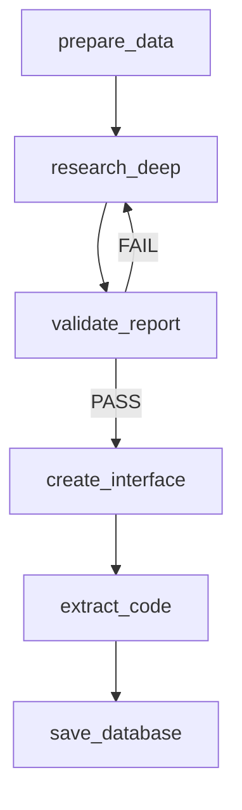

# 📊 Crypto Dashboard & AI Report Generator

Ứng dụng Flask cung cấp dashboard thị trường crypto real-time và AI report generator sử dụng LangGraph workflow.

**🔗 Demo:** [crypto-dashboard-app-thichuong.vercel.app](https://crypto-dashboard-app-thichuong.vercel.app/)

## ✨ Tính Năng

### 📈 Crypto Dashboard
* **Real-time data**: BTC price, market cap, Fear & Greed Index, RSI
* **Smart caching**: 10 phút với rate limiting thông minh  
* **Interactive charts**: SVG-based với dark/light theme
* **Responsive design**: Tối ưu cho mobile và desktop
* **Auto-refresh**: Dữ liệu cập nhật tự động mỗi 10 phút

### 🤖 AI Report Generator
* **Manual**: Upload file (.docx, .odt, .pdf) → web report
* **Auto**: Báo cáo crypto research tự động mỗi 3 giờ
* **LangGraph Workflow**: 6-node pipeline với Google Search integration
* **Combined Research + Validation**: 1 AI call cho research + validation
* **Smart retry**: Exponential backoff với dual retry systems
* **Real-time Data Caching**: Cache và inject dữ liệu thời gian thực vào prompts
* **Multilingual support**: Hỗ trợ tiếng Việt và tiếng Anh
* **Chart generation**: AI tự động tạo biểu đồ phù hợp (Line, Bar, Doughnut, Gauge)

## 🔄 LangGraph Workflow



**6 Nodes chính:**
1. **prepare_data**: Setup Gemini client, cache real-time data một lần
2. **research_deep**: Combined research + validation với Google Search trong 1 AI call
3. **validate_report**: Parse validation result từ combined response, fallback quality scoring
4. **create_interface**: Generate HTML/CSS/JS với AI (separate retry counter)
5. **extract_code**: Extract code blocks từ AI response với success validation
6. **save_database**: Save vào database với Flask context

**Smart Routing:**
- Validation: PASS → continue, FAIL → retry research (max 3)
- Interface: Success → save, Fail → retry interface (max 3)
- **Dual Retry System**: Separate counters cho research và interface generation

### 🔍 Workflow Features

#### 🧠 AI Intelligence
* **Google Gemini 2.5 Pro**: State-of-the-art LLM với thinking capabilities
* **Thinking Budget 30,000**: Cho phép AI suy nghĩ sâu về complex combined operations
* **Context-aware processing**: AI hiểu context và tạo nội dung phù hợp
* **Multi-step reasoning**: Phân tích từng bước để đảm bảo chất lượng
* **Combined Research + Validation**: Thực hiện research và validation trong 1 AI call

#### 🔄 Error Handling & Reliability
* **Exponential backoff**: 45s → 90s → 135s retry timing cho combined calls
* **State preservation**: Không mất dữ liệu khi retry
* **Graceful degradation**: Fallback khi API failures
* **Circuit breaker pattern**: Ngăn cascade failures
* **Dual Retry System**: Separate retry counters cho research (3x) và interface (3x)

#### 📊 Data Processing
* **Real-time integration**: Cache data từ multiple APIs một lần duy nhất
* **Data injection**: Inject cached real-time data vào AI prompts
* **Data validation**: Kiểm tra tính nhất quán của dữ liệu trong combined response
* **Quality scoring**: 5-criteria system với fallback validation (4/5 criteria)
* **Flexible success criteria**: Chấp nhận báo cáo chất lượng cao dù thiếu data không quan trọng

## 🛠️ Tech Stack

**Backend:** Flask, SQLAlchemy, LangGraph, Google Gemini API  
**Frontend:** Tailwind CSS, Custom SVG Charts  
**Database:** PostgreSQL (prod) / SQLite (dev)  
**APIs:** CoinGecko, Alternative.me, Google Search  
**Workflow:** LangGraph StateGraph với conditional routing  
**Deployment:** Vercel serverless platform  

### 🏗️ Architecture Highlights

#### Backend Architecture
* **Flask Application Factory**: Modular design với blueprints
* **SQLAlchemy ORM**: Database abstraction với migration support
* **Redis Caching**: Production caching với fallback to SimpleCache
* **Background Tasks**: Scheduler với APScheduler integration
* **API Rate Limiting**: Smart throttling để tránh quota limits

#### Frontend Design
* **Utility-first CSS**: Tailwind CSS cho rapid development
* **Custom Chart Library**: SVG-based charts với smooth animations
* **Theme System**: Dark/Light mode với CSS custom properties
* **Color Variables**: Extended color palette với bull/bear/sideway card backgrounds
* **Progressive Enhancement**: Works without JavaScript
* **Mobile-first**: Responsive design từ mobile lên desktop

#### Data Pipeline
* **Multi-source aggregation**: CoinGecko + Alternative.me APIs
* **Smart caching strategy**: 10-minute TTL với stale-while-revalidate
* **Error resilience**: Graceful fallbacks khi API down
* **Data validation**: Type checking và business logic validation

## 🚀 Quick Start

```bash
git clone https://github.com/thichuong/crypto-dashboard-app.git
cd crypto-dashboard-app

python -m venv venv
source venv/bin/activate

pip install -r requirements.txt
python build.py
flask run
```

### Environment Setup

```env
# Required for AI reports
GEMINI_API_KEY=your_gemini_key

# Auto Report Scheduler
ENABLE_AUTO_REPORT_SCHEDULER=true
AUTO_REPORT_INTERVAL_HOURS=3
MAX_REPORT_ATTEMPTS=3

# Optional API keys
COINGECKO_API_KEY=your_key
TAAPI_SECRET=your_key
```

## 📖 Cách Sử Dụng

### 📊 Dashboard Features
- **Trang chủ**: Xem dashboard real-time với các metrics quan trọng
- **Auto refresh**: Dữ liệu cập nhật tự động mỗi 10 phút
- **Interactive charts**: Hover để xem chi tiết, click để zoom
- **Theme toggle**: Chuyển đổi dark/light mode dễ dàng
- **Mobile responsive**: Hoạt động mượt mà trên mọi thiết bị

### 📄 Manual Report Generation
1. **Truy cập**: Vào `/upload` để tải file lên
2. **API Key**: Nhập Gemini API Key từ Google AI Studio
3. **Upload**: Chọn file (.docx, .odt, .pdf) - max 10MB
4. **Process**: Nhấn "Tạo Báo Cáo" và chờ AI xử lý
5. **Result**: Xem báo cáo interactive được tạo tự động

### ⚡ Auto Report System
1. **Setup**: Cấu hình `GEMINI_API_KEY` trong `.env`
2. **Enable**: Set `ENABLE_AUTO_REPORT_SCHEDULER=true`
3. **Configure**: Tùy chỉnh interval với `AUTO_REPORT_INTERVAL_HOURS`
4. **Monitor**: Kiểm tra status tại `/scheduler-status`
5. **Access Control**: Sử dụng secret key cho admin access

### 🔧 Advanced Configuration

#### Environment Variables
```env
# Core Settings
FLASK_ENV=development                    # development/production
SECRET_KEY=your-secret-key              # Flask session key
DATABASE_URL=sqlite:///instance/app.db   # Database connection

# API Configuration  
COINGECKO_API_KEY=optional-key          # For higher rate limits
ALTERNATIVE_ME_API_KEY=optional-key     # Fear & Greed Index
TAAPI_SECRET=optional-key               # Technical indicators

# AI Report Settings
GEMINI_API_KEY=required-for-ai          # Google Gemini API
MAX_REPORT_ATTEMPTS=3                   # Retry attempts
THINKING_BUDGET=30000                   # AI thinking budget

# Scheduler Settings
AUTO_REPORT_INTERVAL_HOURS=3            # Report generation interval
AUTO_UPDATE_SECRET_KEY=admin-secret     # Admin panel access
```

#### Production Deployment
```bash
# Vercel deployment
npm i -g vercel
vercel --prod

# Required environment variables on Vercel:
# - DATABASE_URL (PostgreSQL)
# - REDIS_URL (Redis instance)  
# - GEMINI_API_KEY (AI reports)
# - All other keys from .env
```

## 🔧 Project Structure

```
crypto-dashboard-app/
├── 📁 app/                              # Main application package
│   ├── __init__.py                      # Flask app factory
│   ├── extensions.py                    # Flask extensions (SQLAlchemy, etc.)
│   ├── models.py                        # Database models
│   ├── 📁 blueprints/                   # Route blueprints
│   │   └── crypto.py                    # Main routes & API endpoints
│   ├── 📁 services/                     # Business logic services
│   │   ├── api_client.py                # Base HTTP client
│   │   ├── coingecko.py                 # CoinGecko API integration
│   │   ├── alternative_me.py            # Fear & Greed Index API
│   │   ├── taapi.py                     # Technical Analysis API
│   │   ├── report_workflow.py           # LangGraph workflow engine
│   │   ├── auto_report_scheduler.py     # Background scheduler
│   │   └── progress_tracker.py          # Real-time progress tracking
│   ├── 📁 static/                       # Static assets
│   │   ├── 📁 css/                      # Stylesheets
│   │   │   ├── style.css               # Main styles
│   │   │   ├── colors.css              # Color variables
│   │   │   └── chart.css               # Chart-specific styles
│   │   └── 📁 js/                       # JavaScript files
│   │       ├── main.js                 # Core functionality
│   │       ├── chart.js                # Chart library (built)
│   │       ├── dashboard.js            # Dashboard interactions
│   │       └── 📁 chart_modules/        # Individual chart components
│   ├── 📁 templates/                    # Jinja2 templates
│   │   ├── index.html                  # Dashboard homepage
│   │   ├── upload.html                 # File upload page
│   │   └── 📁 components/               # Reusable template components
│   └── 📁 utils/                        # Utility functions
│       └── cache.py                     # Caching utilities
├── 📁 create_report/                    # AI prompt templates
│   ├── prompt_combined_research_validation.md
│   ├── prompt_create_report.md
│   └── prompt_data_validation.md
├── 📁 tests/                           # Testing & development tools
│   ├── chart_tester.html               # Interactive chart testing
│   ├── test_api.py                     # API integration tests
│   └── README.md                       # Testing documentation
├── 📁 instance/                        # Runtime data (gitignored)
│   ├── local_dev.db                   # SQLite database (dev)
│   ├── 📁 archive/                     # Historical report backups
│   └── 📁 backup_cache/                # Cache backups
├── 📄 build.py                         # Chart modules builder
├── 📄 run.py                           # Production WSGI entry point
├── 📄 requirements.txt                 # Python dependencies
└── 📄 vercel.json                      # Vercel deployment config
```

### 🧪 Development & Testing

#### Testing Tools
* **Chart Tester**: `/tests/chart_tester.html` - Interactive chart testing suite
* **API Tests**: Unit tests cho API integrations
* **Rate Limit Testing**: Examples cho API optimization
* **Mobile Testing**: Responsive design validation

#### Development Workflow
```bash
# Development cycle
python build.py        # Build chart modules
flask run              # Start development server
open tests/chart_tester.html  # Test charts

# Code quality
flake8 app/            # Linting
pytest tests/          # Run tests
```

#### Chart Development
* **Modular architecture**: Separate files cho từng chart type
* **Build system**: `build.py` combines modules into `chart.js`
* **Testing suite**: Comprehensive testing tools
* **Performance optimization**: SVG rendering với smooth animations

## 🆕 Recent Updates

### v2.6.0 - Combined Research + Validation (Current)
* **🔄 Workflow Optimization**: Research + validation trong 1 AI call với thinking budget 30,000
* **🧠 Enhanced AI**: Combined operations với Google Search integration
* **💾 Smart Caching**: Cache real-time data một lần và inject vào prompts để tối ưu API calls
* **🔁 Improved Retry**: 45s→90s→135s exponential backoff cho combined calls
* **✅ Quality Scoring**: 5 criteria system với flexible success (4/5) và fallback validation
* **🎯 Dual Retry**: Separate counters cho research (3x) và interface (3x) generation
* **🎨 UI Enhancement**: Thêm sideway-card colors cho market neutral states

### Previous Versions
* **v2.5.0**: Simplified UI với button loading states
* **v2.4.0**: Enhanced validation system với fallback logic
* **v2.3.0**: LangGraph integration với state management
* **v2.2.0**: Auto report scheduler với background tasks
* **v2.1.0**: Combined chart system với SVG optimization

## 🚀 Performance & Scalability

### ⚡ Performance Metrics
* **Dashboard load time**: < 2s on 3G connection
* **Chart rendering**: < 500ms cho complex charts
* **API response time**: < 1s với caching
* **Report generation**: 2-3 minutes cho complete workflow
* **Mobile performance**: 90+ Lighthouse score

### 📈 Scalability Features
* **Horizontal scaling**: Stateless design cho multiple instances
* **Database optimization**: Indexed queries và lazy loading
* **Caching strategy**: Multi-layer caching (Redis + browser)
* **API rate limiting**: Smart throttling cho sustainable usage
* **Resource management**: Memory-efficient chart rendering

## 🛡️ Security & Privacy

### 🔒 Security Measures
* **API Key protection**: Server-side storage, không expose client
* **Input validation**: File type checking và content sanitization
* **Rate limiting**: Protection against abuse và DoS
* **CSRF protection**: Flask-WTF integration
* **Secure headers**: Security headers cho production

### 🔐 Privacy Policy
* **No data collection**: Không lưu trữ personal data
* **API keys**: Chỉ dùng cho session, không persist
* **File processing**: Files được xóa sau processing
* **Analytics**: Không track user behavior
* **GDPR compliant**: EU privacy regulation compliance

## 🤝 Contributing

### 💡 Ways to Contribute
1. **🐛 Bug Reports**: Submit issues với detailed reproduction steps
2. **✨ Feature Requests**: Suggest improvements với use cases
3. **📝 Documentation**: Improve README, comments, hoặc tutorials
4. **🧪 Testing**: Add test cases hoặc improve test coverage
5. **🎨 Design**: UI/UX improvements và accessibility

### � Development Setup
```bash
# Fork repo và clone
git clone https://github.com/your-username/crypto-dashboard-app.git
cd crypto-dashboard-app

# Setup development environment
python -m venv venv
source venv/bin/activate
pip install -r requirements.txt

# Run development server
python build.py
flask run

# Create feature branch
git checkout -b feature/your-feature-name
```

### 📋 Coding Standards
* **Python**: Follow PEP 8 style guide
* **JavaScript**: ES6+ với consistent formatting
* **CSS**: Tailwind utility classes preferred
* **Comments**: Document complex logic và API integrations
* **Tests**: Add tests cho new features

## �🙏 Credits

- **🔗 APIs**: CoinGecko, Alternative.me cho market data
- **🤖 AI**: Google Gemini API cho intelligent report generation
- **☁️ Deployment**: Vercel cho serverless hosting  
- **🎨 Frontend**: Tailwind CSS cho utility-first styling
- **📊 Charts**: Custom SVG library với d3.js inspiration
- **🔄 Workflow**: LangGraph cho AI workflow orchestration

### 🌟 Special Thanks
- **Open Source Community**: Inspiration từ các projects tương tự
- **Contributors**: All developers đã contribute code và feedback
- **Users**: Beta testers đã provide valuable feedback
- **Documentation**: Technical writers đã help improve docs

**⭐ Nếu project này hữu ích, hãy star repo để support development!**

---

## 📞 Support & Contact

**🐛 Issues**: [GitHub Issues](https://github.com/thichuong/crypto-dashboard-app/issues)  
**💬 Discussions**: [GitHub Discussions](https://github.com/thichuong/crypto-dashboard-app/discussions)  
**📧 Email**: thichuong@example.com  
**🔗 Demo**: [Live Application](https://crypto-dashboard-app-thichuong.vercel.app/)

**📄 License**: MIT License - see LICENSE file for details
